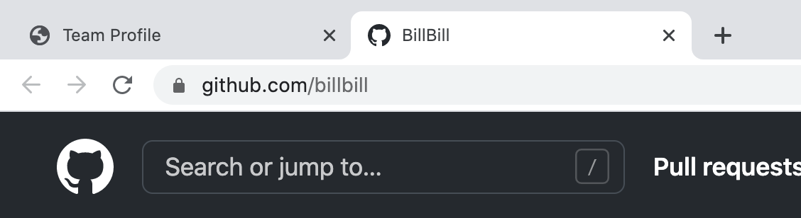

# Team Profile Generator

  
## Description

Create a high quality, profile for your software engineering team team by utilizing this Team Profile Generator application. This a command-line application generates a professional, responsive, HTML document that can be deployed in a web browser from input received by a user utilizing the [Inquirer package](https://www.npmjs.com/package/inquirer).

This application displays employee’s information organized by person. You will easily be able to identify who they are and a summary of their role that allows for quick access to emails and GitHub Profiles.
  
## Table of Contents

* [Installation](#Installation)
* [Usage](#Usage)
* [Mockup](#Mock-Up)
* [License](#License)
* [Tests](#Tests)
* [Questions](#Questions)
  
## Installation

First, ensure that that you have [node.js](https://nodejs.org/en/) installed.
Once this is application is cloned down to your Visual Studio, you will first need to run the following commands to initialize your repository and install inquirer:

* npm init -y
* npm i inquirer --save

## Usage

Watch the following video for step by step instructions on how to use this application: [Video Tutorial](https://drive.google.com/file/d/1DWLgqHyxS8SHytEqKo5Xeuk0PkkludLa/view)

Once Installed, you will run the command node index.js in your terminal. From there you will be asked a series of prompts. Be as detailed as possible when answering. When completed, your Terminal will say ‘your README has generated successfully!’. You will then see your README markdown file will be added to your projects current files. Be sure to review your file, remember to save, commit, and push your file to your GitHub repository.

Team Profile Mockup Functionality:

See a sample of a generated team profile html document in the src folder exampleteamprofile.html

## Mock-Up

The following image shows a mock-up of the generated HTML’s appearance:

### Team Profile HTML Document

### Generated Email

### Github deployed in seperate tab

## License

This application has a MIT License type. Please read more about permissions at [Choose A License](https://choosealicense.com/licenses/)
  
## Tests

This application utilizes [Jest](https://www.npmjs.com/package/jest) for running the unit tests. 

To run the tests type in your terminal npm test [Testing Tutorial](https://drive.google.com/file/d/1Ak6Lw2fualxF1rzq7v0OlhKn5Cn17vQ8/view)

There are four test suites:

* Employee.test.js
* Engineer.test.js
* Intern.test.js
* Manager.test.js

## Questions

Please reach out to me with any additional questions by contacting me.

* GitHub Profile: https://github.com/ross1jk
* My Email Address: Jacqueline.ross09@gmail.com